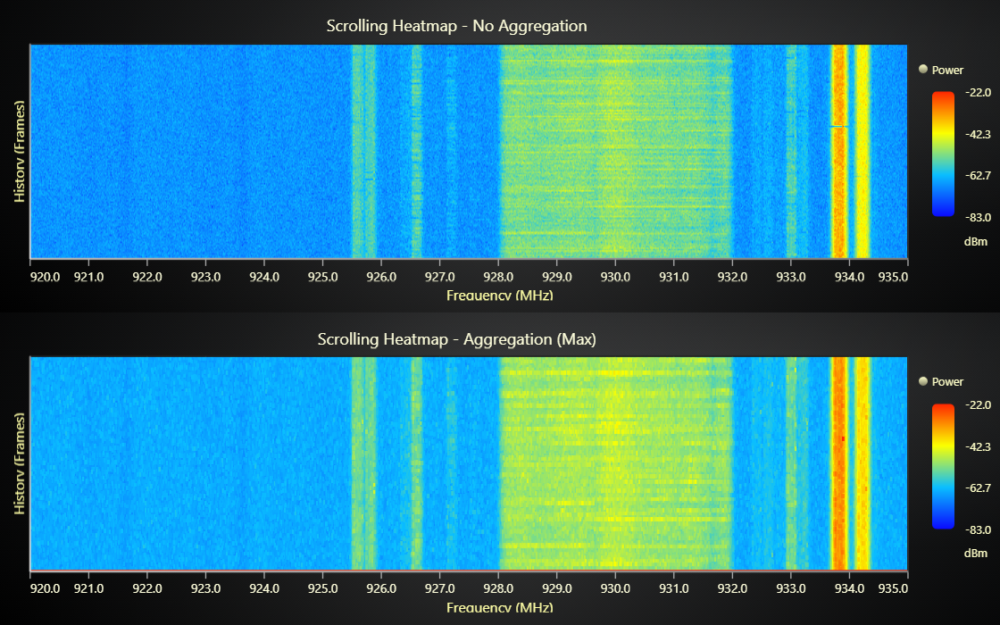

# Scrolling Heatmap Aggregation



This demo application belongs to the set of examples for LightningChart JS, data visualization library for JavaScript.

LightningChart JS is entirely GPU accelerated and performance optimized charting library for presenting massive amounts of data. It offers an easy way of creating sophisticated and interactive charts and adding them to your website or web application.

The demo can be used as an example or a seed project. Local execution requires the following steps:

-   Make sure that relevant version of [Node.js](https://nodejs.org/en/download/) is installed
-   Open the project folder in a terminal:

          npm install              # fetches dependencies
          npm start                # builds an application and starts the development server

-   The application is available at _http://localhost:8080_ in your browser, webpack-dev-server provides hot reload functionality.


## Description

This example demonstrates **Scrolling Heatmap Aggregation** in `HeatmapScrollingGridSeries`. You can also configure aggregation for a static `HeatmapGridSeries`.

By default, heatmaps display the closest heatmap cell value to each pixel that is rendered on the screen. With dense, high resolution heatmaps, this can mean that there is no guarantee which data value is displayed in a pixel.

Heatmap aggregation can be enabled to specify this behavior (which value to show when multiple cell values are contained by single pixel) at the expense of a performance hit.

In this example, the lower heatmap uses the `max` aggregation mode, making sudden **power spikes (shown in red)** much easier to identify in the data stream.

# Heatmap Scrolling Grid Series aggregation

In LightningChart JS, aggregation mode is configured with the `setAggregation` method. By default the aggregation mode is `undefined`. Bilinear interpolation is not supported simultaneously, so remember to disable it with `setIntensityInterpolation('disabled')`. 

```js
// Enable heatmap aggregation (max/min)
heatmapSeries
    .setAggregation('max')
    // Bilinear interpolation is not supported simultaneously
    .setIntensityInterpolation('disabled')
```

The data used in this example: [ElectroSense PSD Spectrum Dataset](https://doi.org/10.5281/zenodo.7521246).

## API Links

* [Scrolling Heatmap Grid Series]
* [Paletted Fill Style]
* [Color Lookup Table]
* [Chart XY]
* [Axis XY]
* [Axis Automatic Scroll Strategies]


## Support

If you notice an error in the example code, please open an issue on [GitHub][0] repository of the entire example.

Official [API documentation][1] can be found on [LightningChart][2] website.

If the docs and other materials do not solve your problem as well as implementation help is needed, ask on [StackOverflow][3] (tagged lightningchart).

If you think you found a bug in the LightningChart JavaScript library, please contact sales@lightningchart.com.

Direct developer email support can be purchased through a [Support Plan][4] or by contacting sales@lightningchart.com.

[0]: https://github.com/Arction/
[1]: https://lightningchart.com/lightningchart-js-api-documentation/
[2]: https://lightningchart.com
[3]: https://stackoverflow.com/questions/tagged/lightningchart
[4]: https://lightningchart.com/support-services/

© LightningChart Ltd 2009-2025. All rights reserved.


[Scrolling Heatmap Grid Series]: https://lightningchart.com/js-charts/api-documentation/v8.1.0/classes/HeatmapScrollingGridSeriesIntensityValues.html
[Paletted Fill Style]: https://lightningchart.com/js-charts/api-documentation/v8.1.0/classes/PalettedFill.html
[Color Lookup Table]: https://lightningchart.com/js-charts/api-documentation/v8.1.0/classes/LUT.html
[Chart XY]: https://lightningchart.com/js-charts/api-documentation/v8.1.0/classes/ChartXY.html
[Axis XY]: https://lightningchart.com/js-charts/api-documentation/v8.1.0/classes/Axis.html
[Axis Automatic Scroll Strategies]: https://lightningchart.com/js-charts/api-documentation/v8.1.0/variables/AxisScrollStrategies.html

